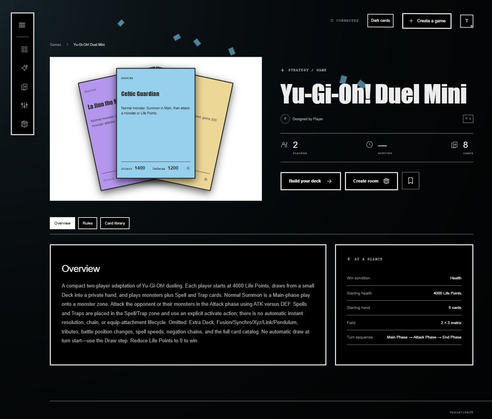
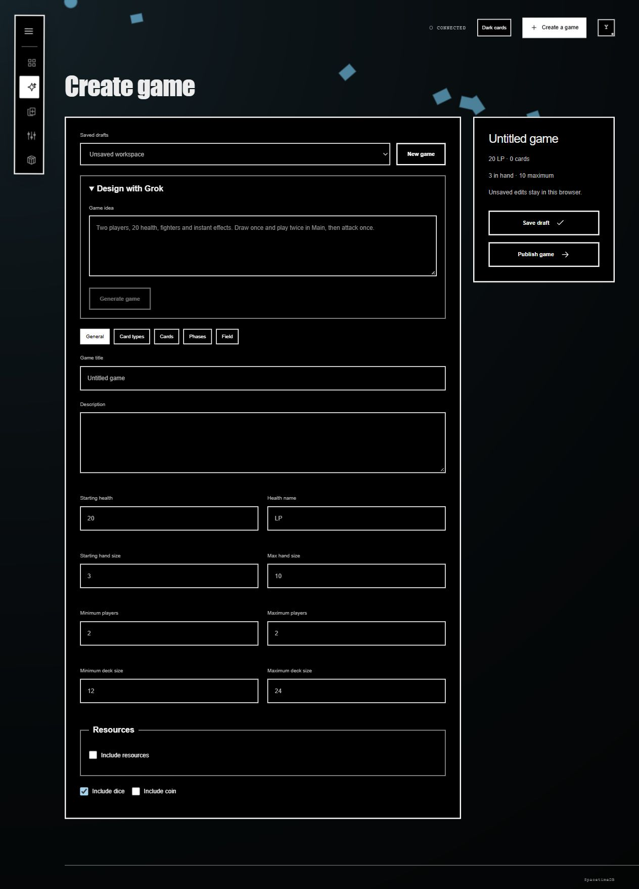
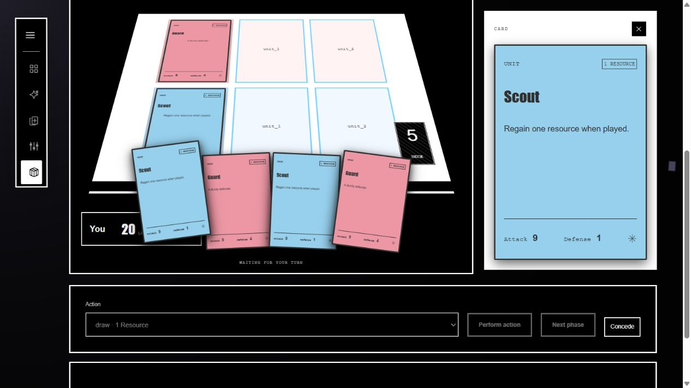

# TCG Unlimited

[Play TCG Unlimited](https://tcg-unlimited.onrender.com/)

Create custom card games with Grok or the visual editor, build and save decks, and play with friends in real-time browser rooms. Built with React, Vite, and SpacetimeDB, which synchronizes matches and enforces the configured rules.

## Screenshots

### Game overview

### Game creation

### In-game card preview

An example match with a readable card preview beside the table.

See the [development guide](tcg-unlimited/README.md) for local setup and backend details.
